# BSA-2022 | Tasque

Tasque is a task tracking system that unites all the good parts of the common task tracking systems and adds something of it's own on a top

## Applications

- [Backend](./backend) — Tasque backend. [.NET 6](https://www.c-sharpcorner.com/article/what-is-new-in-net-6-0/), [PostgreSQL](https://www.postgresql.org), [Amazon DynamoDB](https://aws.amazon.com/dynamodb/).

- [Frontend](./frontend) — Tasque frontend. [Angular 14](https://angular.io/), [rxjs](https://rxjs.dev)

## Requirements

- [NodeJS](https://nodejs.org/en/) (16.10.x);
- [TypeScript](https://www.typescriptlang.org/) (4.8.x);
- [RxJS](https://rxjs.dev/) (7.4.x);
- [NPM](https://www.npmjs.com/) (8.x.x);
- [PostgreSQL](https://www.postgresql.org/) (14.2)

## Tools

- [pgAdmin](https://www.pgadmin.org/)/[DBeaver](https://dbeaver.io/)
- [NoSQL Workbench](https://docs.aws.amazon.com/amazondynamodb/latest/developerguide/workbench.settingup.html)/[Dynobase](https://dynobase.dev/)
- [VSCode](https://code.visualstudio.com/)
- [Visual Studio](https://visualstudio.microsoft.com/vs/)/[Rider](https://www.jetbrains.com/rider/)

### DB Schema

```mermaid
erDiagram
    Users {
        integer Id
        text Password
        text Salt
        text Email
        timestamp_with_time_zone UpdatedAt
        timestamp_with_time_zone CreatedAt
        text Name
        boolean IsEmailConfirmed
        text AvatarURL
    }

    Projects {
        integer Id
        text Name
        integer AuthorId
        timestamp_with_time_zone CreatedAt
        timestamp_with_time_zone UpdatedAt
        integer OrganizationId
        text Key
    }

    Notifications {
        integer Id
        text Message
        integer UserId
        timestamp_with_time_zone CreatedAt
        timestamp_with_time_zone UpdatedAt
    }

    TaskPriorities {
        integer Id
        text Name
        timestamp_with_time_zone CreatedAt
        timestamp_with_time_zone UpdatedAt
    }

    TaskStates {
        integer Id
        text Name
        timestamp_with_time_zone CreatedAt
        timestamp_with_time_zone UpdatedAt
    }

    TaskTypes {
        integer Id
        text Name
        timestamp_with_time_zone CreatedAt
        timestamp_with_time_zone UpdatedAt
    }

    Comments {
        integer Id
        text Message
        integer AuthorId
        integer TaskId
        timestamp_with_time_zone CreatedAt
        timestamp_with_time_zone UpdatedAt
    }

    Roles {
        integer Id
        text Name
        timestamp_with_time_zone CreatedAt
        timestamp_with_time_zone UpdatedAt
    }

    MeetingUser {
        integer MeetingsId
        integer UsersId
    }

    BoardColumns {
        integer Id
        text Name
        integer ProjectId
        timestamp_with_time_zone CreatedAt
        timestamp_with_time_zone UpdatedAt
    }

    Attachments {
        integer Id
        text URL
        timestamp_with_time_zone CreatedAt
        timestamp_with_time_zone UpdatedAt
    }

    Sprints {
        integer Id
        text Name
        text Description
        timestamp_with_time_zone CreatedAt
        timestamp_with_time_zone UpdatedAt
        timestamp_with_time_zone EndAt
        integer ProjectId
        timestamp_with_time_zone StartAt
        boolean IsComplete
        integer Order
    }

    Tasks {
        integer Id
        text Description
        text Summary
        integer StateId
        integer TypeId
        integer PriorityId
        timestamp_with_time_zone Deadline
        timestamp_with_time_zone FinishedAt
        integer AuthorId
        integer ProjectId
        integer BoardColumnId
        integer SprintId
        integer LastUpdatedById
        integer ParentTaskId
        timestamp_with_time_zone CreatedAt
        timestamp_with_time_zone UpdatedAt
        integer Estimate
    }

    OrganizationUser {
        integer ParticipatedOrganizationId
        integer UsersId
    }

    UserOrganizationRoles {
        integer OrganizationId
        integer UserId
        integer Role
    }

    Calendars {
        integer Id
        integer UserId
        timestamp_with_time_zone CreatedAt
        timestamp_with_time_zone UpdatedAt
    }

    Organizations {
        integer Id
        text Name
        integer AuthorId
        timestamp_with_time_zone CreatedAt
        timestamp_with_time_zone UpdatedAt
    }

    ProjectUser {
        integer ParticipatedProjectsId
        integer UsersId
    }

    TaskUser {
        integer ParticipatedTasksId
        integer UsersId
    }

    ConfirmationTokens {
        uuid Token
        integer UserId
        timestamp_with_time_zone ExpiringAt
        integer Kind
    }

    UserProjectRoles {
        integer RoleId
        integer UserId
        integer ProjectId
    }

    Labels {
        integer Id
        text Name
        integer ProjectId
        timestamp_with_time_zone CreatedAt
        timestamp_with_time_zone UpdatedAt
    }

    Meetings {
        integer Id
        timestamp_with_time_zone StartingTime
        timestamp_with_time_zone EndingTime
        integer CalendarId
        timestamp_with_time_zone CreatedAt
        timestamp_with_time_zone UpdatedAt
    }

    LabelTask {
        integer LabelsId
        integer TasksId
    }

    AttachmentTask {
        integer AttachmentsId
        integer TasksId
		}

    TaskPriority ||--o{ Project : projectId_id
    TaskPriority {
        id int PK
	      projectId int FK
        name string
	      color string
        created_at datetime
        updated_at datetime
    }

    Calendars }o--|| Users : "UserId"
    Notifications }o--|| Users : "UserId"
    Organizations }o--|| Users : "AuthorId"
    Tasks }o--|| Users : "AuthorId"
    Tasks }o--|| Users : "LastUpdatedById"
    MeetingUser }o--|| Users : "UsersId"
    Comments }o--|| Users : "AuthorId"
    Projects }o--|| Users : "AuthorId"
    ProjectUser }o--|| Users : "UsersId"
    TaskUser }o--|| Users : "UsersId"
    ConfirmationTokens }o--|| Users : "UserId"
    UserProjectRoles }o--|| Users : "UserId"
    OrganizationUser }o--|| Users : "UsersId"
    UserOrganizationRoles }o--|| Users : "UserId"
    Labels }o--|| Projects : "ProjectId"
    Tasks }o--|| Projects : "ProjectId"
    Projects }o--|| Organizations : "OrganizationId"
    ProjectUser }o--|| Projects : "ParticipatedProjectsId"
    UserProjectRoles }o--|| Projects : "ProjectId"
    Sprints }o--|| Projects : "ProjectId"
    BoardColumns }o--|| Projects : "ProjectId"
    Tasks }o--|| TaskPriorities : "PriorityId"
    Tasks }o--|| TaskStates : "StateId"
    Tasks }o--|| TaskTypes : "TypeId"
    Comments }o--|| Tasks : "TaskId"
    UserProjectRoles }o--|| Roles : "RoleId"
    MeetingUser }o--|| Meetings : "MeetingsId"
    Tasks }o--|| BoardColumns : "BoardColumnId"
    AttachmentTask }o--|| Attachments : "AttachmentsId"
    Tasks }o--|| Sprints : "SprintId"
    Tasks }o--|| Tasks : "ParentTaskId"
    AttachmentTask }o--|| Tasks : "TasksId"
    LabelTask }o--|| Tasks : "TasksId"
    TaskUser }o--|| Tasks : "ParticipatedTasksId"
    OrganizationUser }o--|| Organizations : "ParticipatedOrganizationId"
    UserOrganizationRoles }o--|| Organizations : "OrganizationId"
    Meetings }o--|| Calendars : "CalendarId"
    LabelTask }o--|| Labels : "LabelsId"

```

